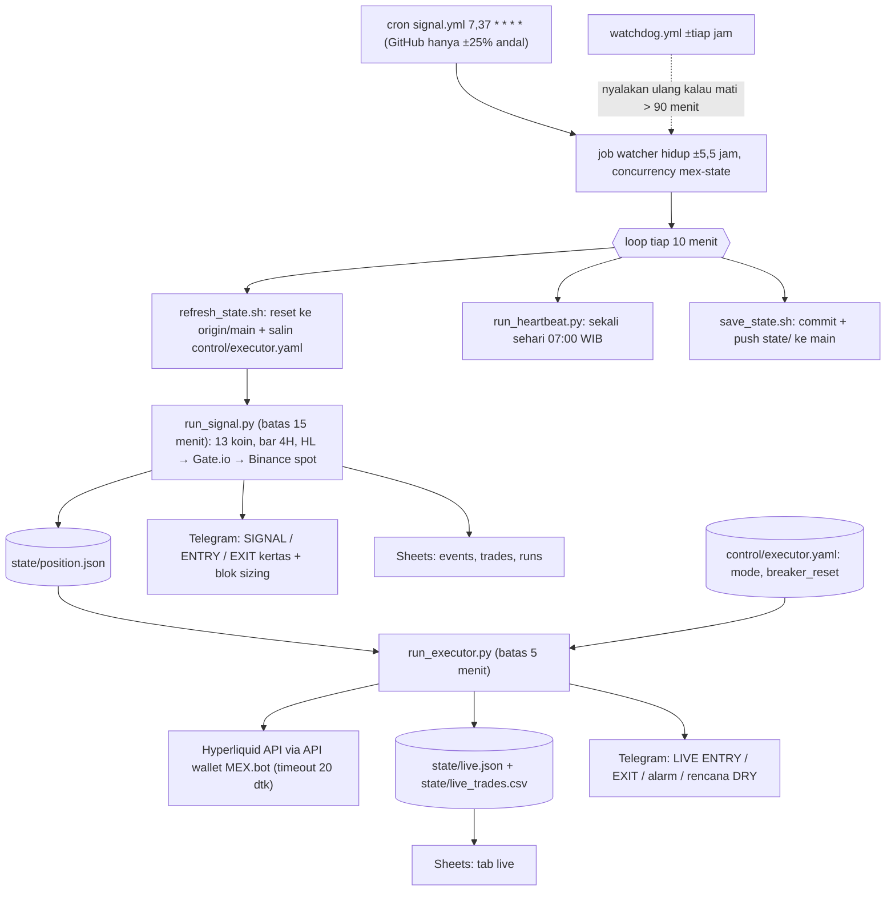
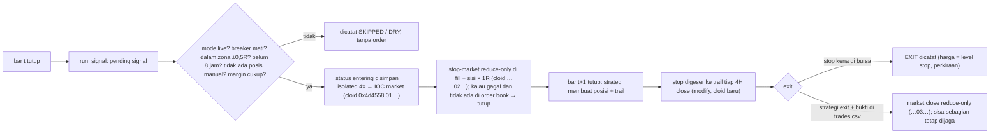

# MEX 3.0 — Momentum Exhaustion Breakout di Hyperliquid

> **Dokumen induk proyek.** Satu file yang memuat latar belakang, seluruh hasil
> riset dan backtest, keputusan, arsitektur, riwayat, kondisi sekarang, risiko,
> dan rencana kerja. Dokumen lain di repo (`docs/`, `backtest/*/REPORT.md`,
> `CHANGELOG.md`) adalah rincian; file ini ringkasan lengkapnya.
>
> **Per 2026-10-01 07:10 UTC (14:10 WIB); hasil canary ditambahkan 07:30 UTC** · repo [`daijobudesu69/Crypto-MEX`](https://github.com/daijobudesu69/Crypto-MEX) (publik)
> · engine `mex-fwd-2.2.0`

---

## Daftar isi

1. [Ringkasan](#1-ringkasan)
2. [Status sekarang](#2-status-sekarang)
3. [Latar belakang dan sejarah](#3-latar-belakang-dan-sejarah)
4. [Strategi (beku)](#4-strategi-beku)
5. [Hasil riset dan backtest](#5-hasil-riset-dan-backtest)
6. [Keputusan](#6-keputusan)
7. [Arsitektur dan cara kerja](#7-arsitektur-dan-cara-kerja)
8. [Keandalan: audit, insiden, perbaikan](#8-keandalan-audit-insiden-perbaikan)
9. [Riwayat pull request](#9-riwayat-pull-request)
10. [Hasil forward test sejauh ini](#10-hasil-forward-test-sejauh-ini)
11. [Operasional (runbook)](#11-operasional-runbook)
12. [Risiko dan keterbatasan](#12-risiko-dan-keterbatasan)
13. [Action plan](#13-action-plan)
14. [Cara menilai hasil](#14-cara-menilai-hasil)
15. [Aturan kerja proyek](#15-aturan-kerja-proyek)
16. [Lampiran](#16-lampiran)

---

## 1. Ringkasan

**Apa ini.** MEX (Momentum Exhaustion Breakout) adalah strategi 4 jam yang
membeli *breakout* harga yang disertai lonjakan volume, lalu keluar hanya lewat
trailing stop (tanpa take profit). Repo ini menjalankan:

1. **Forward test (kertas)** di 13 perpetual Hyperliquid, mencatat setiap sinyal,
   entry, dan exit ke CSV, Telegram, dan Google Sheets.
2. **Executor MEX 3.0**, bot yang meniru forward test itu ke akun Hyperliquid
   sungguhan (isolated 4x, risiko 1% saldo per transaksi). Saat ini masih mode
   **`dry`**: rencana order dikirim ke Telegram, tidak ada order sungguhan.

**Perjalanan singkat.**

| Versi | Periode | Isi |
|---|---|---|
| MEX 1.0 | Ags 2026 | Validasi T0–T14 di ETHUSDT (Binance) → **gagal 5/7 kriteria**, keyakinan 25%. Forward test kertas ETH dimulai 30 Ags. |
| MEX 2.0 | Sep 2026 | Baterai T0–T14 di 20 koin Binance: sinyal nyata di level universe (PBO 0,314 lolos) tapi OOS tetap meluruh. Forward test diperluas ke ETH, DOGE, XRP, SOL. |
| **MEX 3.0** | 27 Sep 2026 → | Backtest 30 koin di data Hyperliquid → 13 koin dipilih → forward test di data Hyperliquid → **executor uang sungguhan** (pemilik memutuskan 29 Sep). |

**Angka kunci.**

| | Nilai |
|---|---|
| Backtest Hyperliquid 30 koin (Jun 2024 → Sep 2026, net biaya + funding) | 2.651 trx · **+0,105 R/trx** · win 38,9% · PF 1,28 · t 4,38 · 23/30 koin positif |
| 13 koin terpilih (bagian dari backtest yang sama) | 1.216 trx · **+0,221 R/trx** · PF 1,63 · t 5,75 (ada bias seleksi) |
| Ekspektasi realistis live | Antara skenario B (**+53%/thn, DD 39%**) dan C (**+12%/thn, DD 50%**) |
| Akun | 127,52 USDC, 0 posisi, unified account |
| Forward test kertas (30 Ags → sekarang) | 11 transaksi selesai, **+0,50 R total** (+0,046 R/trx); sampel terlalu kecil untuk dinilai |
| Tes otomatis | 510 offline lulus + 2 tes SDK asli di CI |
| **Canary order sungguhan (1 Okt)** | **10/10 langkah ✅**, akun bersih sesudahnya (0 order, 0 posisi, 0 fill, saldo tidak berubah) |

**Langkah berikutnya:** dry run ±10 sinyal → pemilik menyalakan mode `live` →
mengawal 3 trade live pertama (detail di §13). Canary sudah lulus.

---

## 2. Status sekarang

| Komponen | Status |
|---|---|
| Watcher (`signal.yml`) | Hidup, cek tiap 10 menit, simpan state ke `main` minimal tiap jam. Terakhir 07:04 UTC. |
| Forward test | 13 koin di data Hyperliquid. Posisi kertas terbuka: **MNT long `20260930T1200-L`**. |
| Executor | Mode **`dry`** (dari `control/executor.yaml`; `live.json.mode_seen = "dry"`). Sinyal MNT tercatat SKIPPED "terlewat" karena watcher mati saat sinyal masih berlaku (insiden 30 Sep). |
| Akun Hyperliquid | `0x123bb2a1FE74395a57081d48077C28c9cA55a93B` · 127,52 USDC · 0 posisi · 0 order |
| API wallet `MEX.bot` | `0x329e707a50b77bd851d220d53efab0491960e797`, berlaku sampai **2027-03-30 03:29 UTC** |
| Circuit breaker | Tidak aktif. Puncak saldo 127,52. |
| Watchdog (`watchdog.yml`) | Aktif sejak 1 Okt, uji pertama sukses ("watcher sehat") |
| Canary (`canary.yml`) | **Lulus 10/10** (1 Okt ±07:25 UTC, ETH, dijalankan pemilik). Detail §11.2. |
| Google Sheets | Tab `events`, `trades`, `runs` sehat (`sheet_ok = ok` di semua run sejak 14 Sep). Tab `live` aktif sejak 1 Okt 06:54 UTC. |
| PR terbuka | Tidak ada |

---

## 3. Latar belakang dan sejarah

### 3.1 Asal strategi

Backtest TradingView pada ETHUSDT.P 4H (Jan 2024 – Ags 2026) menunjukkan
+35,87% s/d +41,72%, dengan ekspektansi per transaksi yang tidak berubah di tiga
model eksekusi. Itu mengisyaratkan edge yang nyata, tapi belum ada uji
out-of-sample, uji entry acak, ataupun uji signifikansi. Proyek ini lahir untuk
menjawabnya dengan jujur.

### 3.2 Linimasa

| Tanggal (2026) | Peristiwa | Rujukan |
|---|---|---|
| Ags | Mesin backtest Python independen dibangun, baterai T0–T14 dijalankan di ETH. Vonis: **FAIL, keyakinan 25%**. Desain eksekusi manual (trailing stop dengan callback beku). | `docs/PROJECT_LOG.md` |
| 30 Ags | **Forward test kertas ETH dimulai** (`181159d`): engine sinyal, Telegram, logger CSV. | CHANGELOG 08-30 |
| 31 Ags | Mirror Google Sheets lewat service account. Insiden kebocoran kunci service account di log publik; kunci dirotasi dalam hitungan menit. | PROJECT_LOG §Incidents |
| 3–5 Sep | Audit infrastruktur #1: 23+4 temuan, 26 selesai. Cron diganti **watcher yang hidup 5,5 jam**, latensi sinyal 92 menit → ≤10 menit. Heartbeat pindah ke loop. | `docs/AUDIT-2026-09.md` |
| ~21 Sep | **MEX 2.0**: T0–T14 di 20 koin Binance (2.207 trx). | `Backtest MEX 2.0 Strategy/README.md` (lokal) |
| 21 Sep | **PR #1**: forward test 4 simbol (ETH, DOGE, XRP, SOL), state schema 2. | PR #1 |
| 22 Sep | **PR #2**: audit lanjutan; `last_bar` hanya boleh maju, mirror Sheets dicocokkan per nama kolom, uji invarian pipeline. | `docs/FIXES-2026-09-22.md` |
| 27 Sep | Backtest 30 koin di data perp Hyperliquid + head-to-head HL vs Binance. | `backtest/hyperliquid/`, `backtest/h2h/` |
| 28 Sep | 13 koin dipilih; sumber utama Hyperliquid (`mex-fwd-2.2.0`). | CHANGELOG 09-28 |
| 29 Sep | **Keputusan pemilik: MEX 3.0 memakai uang sungguhan.** Studi sizing & leverage → isolated 4x. Akun + API wallet disiapkan. | CHANGELOG 09-29 |
| 30 Sep | **PR #3** (13 koin + sizing) dan **PR #4** (executor, default dry) di-merge. Audit eksternal executor → **PR #5** (18 temuan, circuit breaker 40%). | `docs/AUDIT-2026-09-30-EXECUTOR.md` |
| 30 Sep 12:08 → 1 Okt 03:40 | **Insiden: watcher mati ±15 jam** (kunci salah isi + `bash -e`). | CHANGELOG 10-01 |
| 1 Okt | **PR #6, #7** (perbaikan insiden, API wallet baru). Audit infrastruktur #2 → **PR #8** (7 perbaikan + kendali mode tiap 10 menit). **PR #9** canary, **PR #10** watchdog, **PR #11** tab `live` di Sheets, **PR #12** dokumen ini. **Canary dijalankan pemilik: lulus 10/10.** | §8, §9, §11.2 |

### 3.3 Kenapa pindah ke Hyperliquid

- Akses Binance Futures API (`fapi.binance.com`) diblokir dari runner GitHub (HTTP 451)
  dan time-out dari ISP pemilik, sehingga forward test lama memakai mirror Binance
  **spot**, dengan tracking error ±4–10% sinyal (§5.4).
- Pemilik trading di Hyperliquid. Data dan eksekusi di venue yang sama menghapus
  tracking error antara sinyal dan order.
- Backtest di data Hyperliquid (§5.5) dan head-to-head (§5.7) menunjukkan edge-nya
  setara dengan Binance (0,298 vs 0,301 R pada bar yang identik).

---

## 4. Strategi (beku)

> **Aturan dan parameter strategi tidak boleh diubah.** `mex/strategy.py` dan
> blok `strategy:` di `config.yaml` identik dengan yang divalidasi.
> `tests/test_strategy.py` menjaga paritas **bit-identik** dengan mesin backtest
> (4.000 bar perp Binance asli: 131 sinyal long, 13 fade short, nol beda).
> Setiap perubahan config wajib dicatat di `CHANGELOG.md` dengan tanggal dan alasan.

**Dievaluasi saat lilin 4H tutup, entry di open lilin berikutnya.**

```
breakout : high > high tertinggi 20 lilin SEBELUMNYA (lilin berjalan tidak dihitung)
volume   : volume > 1,5 × SMA(volume, 20)
```

| | LONG | FADE SHORT |
|---|---|---|
| Tren | EMA20 > EMA50 | EMA20 < EMA50 |
| RSI(14) | > 55 **dan** naik dibanding 5 lilin lalu | < puncak RSI 20 lilin **atau** turun dibanding 5 lilin lalu |

**Exit: hanya trailing stop, tanpa take profit.**

```
1R            = 1,5 × ATR(14) di bar entry
callback      = 1R ÷ harga entry   ← DIBEKUKAN saat entry
trail         = max(trail lama, high-water × (1 − callback))   (short: kebalikannya)
```

- Trail diuji terhadap bar **berikutnya** (level yang dihitung saat bar t-1 tutup
  diuji ke low bar t), jadi tidak ada lookahead. Trail tidak pernah mengendur.
- Sinyal sah dalam **±0,5R** dari harga referensi (close bar sinyal) dan **hangus
  8 jam** setelah bar sinyal dibuka.

| Parameter | Nilai | | Parameter | Nilai |
|---|---|---|---|---|
| `n_lookback` | 20 | | `rsi_confirm` | 55 |
| `vol_len` / `vol_mult` | 20 / 1,5 | | `atr_len` / `atr_sl_mult` | 14 / 1,5 |
| `ema_fast` / `ema_slow` | 20 / 50 | | `allow_shorts` | true |
| `rsi_len` / `roc_len` | 14 / 5 | | `entry_zone_r` / `expiry_hours` | 0,5 / 8 |

---

## 5. Hasil riset dan backtest

### 5.1 Validasi asli MEX 1.0 — ETHUSDT Binance perp (T0–T14)

Data: 7.116 bar 4H ETHUSDT, 2023-06-01 → 2026-08-29, 0 bar hilang
(`data.binance.vision`). Mesin Python bar-per-bar independen.

**Vonis: FAIL — keyakinan 25%.** Sinyal entry-nya nyata (persentil 99,7 vs entry
acak), tapi konfigurasinya belum layak live.

| Pertanyaan | Keyakinan |
|---|---|
| Apakah entry MEX punya edge di atas entry acak? | ~90% |
| Apakah konfigurasi baseline cukup stabil untuk live? | ~25% |

**Checklist penerimaan (aturannya: semua harus lolos) — 5 dari 7:**

| # | Kriteria | Hasil | |
|---|---|---|---|
| 1 | Replikasi T0 | +42,03% vs +41,72% referensi | ✅ |
| 2 | Ekspektansi OOS ≥ 60% IS | **21,4%** (B) / 4,5% (C) | ❌ |
| 3 | PnL > persentil 95 entry acak | persentil **99,7** | ✅ |
| 4 | PBO < 0,5 | **0,567** (B) / **0,738** (C) | ❌ |
| 5 | Tetap positif tanpa 5 pemenang terbesar | +9,65 (B) | ✅ |
| 6 | ≥ 60% simbol berekspektansi positif | 85,7% (18/21) | ✅ |
| 7 | Break-even biaya ≥ 2× biaya nyata | **8,2×** | ✅ |

**Angka baseline (Mode B):** 118 transaksi (101 long / 17 fade short) · +42,03%
dalam 32 bulan = **+14,09%/tahun** · max DD 7,95% · PF 1,95 · win 44,9% ·
**+0,31 R/trx** · rata-rata tahan 20 jam · waktu di pasar 10,3% · Sharpe 1,54 ·
t = 2,20.

| Uji | Temuan |
|---|---|
| T0 replikasi | ✅ +42,03% vs +41,72%, 118 vs 117 trx |
| T1 out-of-sample | ❌ IS 0,398 R → OOS **0,085 R** (34 trx, p = 0,287) |
| T2 walk-forward | ❌ 86% jendela untung, tapi **WFE 0,07** |
| T3 dataran parameter | ⚠️ 4/7 parameter di puncak lokal, tidak ada jurang rugi |
| T4 urutan trade | ✅ p05 ekuitas 111,9; harap 11 rugi beruntun, toleransi 20 |
| T5 outlier | ⚠️ 5 pemenang teratas = **77% PnL** |
| T6 lintas simbol | ✅ 18/21 positif |
| T7 regime | ℹ️ hampir semua edge di BTC bull (0,444 vs 0,071 R) — belakangan dibantah MEX 2.0 |
| T9 signifikansi | ❌ DSR p 0,134, PBO 0,567/0,738 |
| T10 biaya | ✅ break-even 8,2× |
| T11 risiko | ℹ️ default 1%, plafon 1,75% untuk DD 15%; abaikan Kelly 25% |
| T13 entry acak | ✅ persentil **99,7** |
| T14 lookahead | ✅ bersih |

### 5.2 Desain eksekusi (dari validasi asli)

- **118/118 transaksi keluar lewat trailing stop**, tidak satu pun lewat target.
  Pemenang menyentuh +6,45% di puncak tapi keluar di +3,50%: ±3 poin dikembalikan
  per pemenang. Itu harga sistem tanpa TP.
- Memaksa TP: TP 1R memangkas sepertiga profit. Bracket statis (SL + TP 4R tanpa
  trailing) hampir menyamai profit tapi **drawdown hampir 3×** (23,16% vs 7,95%).
  Trailing stop bukan sumber profit; ia penahan risiko.
- **Callback dihitung per transaksi dan dibekukan** (1,5×ATR/harga): +14,24%/thn,
  PF/DD 3,55, praktis sama dengan menggeser manual tiap 4 jam. Callback tetap
  2,75% (rata-rata) **memotong return setengahnya** dan negatif di 2026.
- "Risiko 1%" hanya berlaku saat entry. Rata-rata rugi nyata **0,55 R**; terburuk
  1,09 R; 0/118 keluar di stop awal (trail selalu sudah bergerak).

### 5.3 MEX 2.0 — T0–T14 di 20 koin Binance

Jendela 2024-01-01 → 2026-08-29, parameter tidak disetel ulang, biaya 0,04% +
1 tick per sisi, funding dihitung, **2.207 transaksi**. Mesin disalin byte-per-byte
dari repo ini; lima angka independen cocok dengan dokumen asli.

| Koin | Trx | % profit | Exp R | t | OOS % IS | vs acak | Skor |
|---|---|---|---|---|---|---|---|
| **DOGE** | 111 | **+54,4%** | +0,403 | 2,83 | 79% | 99,9 | **4/4** |
| **BTC** | 124 | +29,6% | +0,216 | 1,99 | 76% | 96,8 | **4/4** |
| ETH (kontrol) | 114 | +40,3% | +0,307 | 2,33 | 21% | 99,6 | 3/4 |
| XRP | 101 | +24,5% | +0,226 | 1,68 | 589% | 97,3 | 3/4 |
| ZEC | 111 | +22,0% | +0,187 | 1,57 | 198% | 88,0 | 3/4 |
| SHIB | 112 | +20,5% | +0,175 | 1,38 | 55% | 97,7 | 3/4 |
| SOL | 113 | +19,6% | +0,165 | 1,47 | 285% | 97,1 | 3/4 |
| TRX | 108 | +30,2% | +0,252 | 2,11 | −12% | 86,7 | 2/4 |
| SUI | 112 | +14,4% | +0,127 | 1,12 | 514% | 94,0 | 2/4 |
| NEAR | 102 | +4,1% | +0,047 | 0,39 | 225% | 73,8 | 2/4 |
| HBAR | 106 | +13,5% | +0,130 | 0,89 | −108% | 93,7 | 1/4 |
| AVAX | 97 | +11,1% | +0,115 | 1,02 | −39% | 90,5 | 1/4 |
| LINK | 109 | +9,4% | +0,088 | 0,86 | −38% | 84,8 | 1/4 |
| UNI | 107 | +9,0% | +0,087 | 0,77 | 6% | 86,4 | 1/4 |
| ADA | 105 | +8,9% | +0,089 | 0,71 | −72% | 90,9 | 1/4 |
| XLM | 98 | +8,4% | +0,089 | 0,74 | −2% | 86,9 | 1/4 |
| BNB | 129 | −0,9% | −0,002 | −0,03 | −351% | 55,6 | 0/4 |
| LTC | 113 | −5,3% | −0,043 | −0,47 | −534% | 66,3 | 0/4 |
| BCH | 122 | −13,2% | −0,110 | −1,13 | — | 35,6 | 0/4 |
| XMR | 113 | −22,4% | −0,219 | −2,18 | — | 1,3 | 0/4 |

Positif 16/20 · rata-rata +13,9% · median +12,3%.

| Uji | 20 koin | ETH asli |
|---|---|---|
| T1 OOS | ❌ OOS **39,9%** dari IS (t 4,47 → 1,07) | 21,4% |
| T2 walk-forward | ❌ WFE median −0,112; tapi **baseline tetap untung 20/21 jendela**. Re-optimasi merusak; jangan dioptimasi. | WFE 0,07 |
| T3 dataran | ✅ 2/7 di puncak, **0/7 setelan merugi** | 4/7 di puncak |
| T5 outlier | ⚠️ tanpa top-5: 14/20 negatif | 77% dari 5 trx |
| T6 lintas simbol | ✅ 16/20 | 18/21 |
| T7 regime | ℹ️ pembeda sebenarnya **ADX simbol** (ADX>20: +0,153 R, t 4,81; ADX<20: +0,026 R) | "BTC bull" |
| T9 signifikansi | ✅ **PBO 0,314 lolos**; DSR p 0,061 | PBO 0,567/0,738 |
| T10 biaya | ✅ break-even ≥2× di 16/20 | 8,2× |
| T11 risiko | ℹ️ plafon median 2,01%; default 1% aman di 17/20 | 1,75% |
| T12 timeframe | ✅ hidup di 4H (t 4,40), 8H, 1D; mati di 1H/2H (biaya memakan R kecil) | — |
| T13 entry acak | ✅ gabungan Fisher **p = 2,8e-07** (per koin 6/20) | persentil 99,7 |
| T14 lookahead | ✅ bersih, monoton | ✅ |

**Bacaan:** sinyal entry nyata di level universe, parameternya stabil lintas
sampel (PBO lolos), tapi edge **meluruh ke depan** (T1, T2). Pola itu konsisten
dengan "berhenti mengoptimasi, biarkan parameter tetap".

### 5.4 Tracking error forward test lama (Binance spot vs perp)

Forward test lama memakai Binance spot karena `fapi` diblokir. Diukur 3.878 bar
(Nov 2024 – Ags 2026) terhadap arsip perp resmi:

| Simbol | Sinyal cocok | Beda harga | Beda ATR |
|---|---|---|---|
| ETH (kontrol) | 94,9% | 0,046% | 1,89% |
| XRP | 96,9% | 0,050% | 0,83% |
| DOGE | 94,3% | 0,050% | 0,86% |
| SOL | 90,0% | 0,053% | 1,18% |

Sejak 30 Sep (PR #3) sumber utamanya Hyperliquid, venue yang sama dengan eksekusi.

### 5.5 Backtest Hyperliquid — 30 koin market cap terbesar

`tools/backtest_hyperliquid.py`, dibuat 2026-09-27. Universe: 30 koin teratas
CoinGecko tanpa BTC, stablecoin, emas, dan token bungkus; hanya yang punya perp
Hyperliquid dengan harga live dalam 10% dari CoinGecko. Data: candle perp
Hyperliquid (maks 5.000 candle → mulai **2024-06-14**). Biaya **0,045% taker +
0,01% slippage per sisi**, plus **funding per jam asli**.

| | Semua | Long | Fade short | Patokan ETH Binance |
|---|---|---|---|---|
| Transaksi | 2.651 | 2.151 | 500 | 118 |
| Win rate | 38,9% | 38,4% | 40,8% | 44,9% |
| Ekspektansi net | **+0,105 R** | +0,112 R | +0,074 R | +0,31 R |
| Sebelum biaya / fee+slip / funding | +0,147 / −0,035 / −0,007 R | | | |
| Total R | +278,7 | +241,7 | +37,0 | |
| Profit factor | 1,28 | 1,30 | 1,20 | 1,95 |
| t-stat | 4,38 | 4,11 | 1,53 | 2,20 |
| Koin positif | **23/30** | | | 18/21 |

**Portofolio** (30 koin bersamaan, 1% modal awal per trx, tanpa majemuk):
**+278,7%**, max DD 67,6 poin = **20,2%** dari puncak.

**Per koin** (profit sudah dipotong fee, slippage, funding; dimajemukkan):

| # | Koin | Dari | Trx | Win | **Profit @risiko 1%** | DD @1% | Profit modal penuh 1x | Exp R | PF |
|---|---|---|---|---|---|---|---|---|---|
| 1 | **DOGE** | 2024-06 | 100 | 47,0% | **+46,2%** | 3,8% | +232,8% | +0,391 | 2,24 |
| 2 | **XRP** | 2024-06 | 89 | 47,2% | **+36,9%** | 5,3% | +237,9% | +0,365 | 2,11 |
| 3 | **HYPE** | 2024-12 | 72 | 43,1% | **+24,7%** | 4,1% | +169,8% | +0,316 | 2,16 |
| 4 | **TAO** | 2024-06 | 92 | 47,8% | **+23,6%** | 6,5% | +81,0% | +0,237 | 1,81 |
| 5 | **MNT** | 2024-06 | 100 | 45,0% | **+21,9%** | 5,8% | +101,0% | +0,205 | 1,55 |
| 6 | **ETH** | 2024-06 | 96 | 42,7% | **+21,4%** | 10,4% | +33,1% | +0,213 | 1,58 |
| 7 | **SUI** | 2024-06 | 93 | 40,9% | **+21,0%** | 4,5% | +105,8% | +0,214 | 1,64 |
| 8 | **SOL** | 2024-06 | 94 | 41,5% | **+18,1%** | 7,2% | +43,8% | +0,184 | 1,55 |
| 9 | **SHIB** | 2024-06 | 85 | 38,8% | **+17,1%** | 8,1% | +55,9% | +0,195 | 1,47 |
| 10 | **DOT** | 2024-06 | 86 | 40,7% | **+16,2%** | 6,7% | +45,5% | +0,184 | 1,54 |
| 11 | **ENA** | 2024-06 | 99 | 37,4% | **+14,9%** | 9,0% | +25,6% | +0,151 | 1,39 |
| 12 | **LINK** | 2024-06 | 105 | 41,9% | **+14,5%** | 9,8% | +45,1% | +0,136 | 1,37 |
| 13 | **NEAR** | 2024-06 | 105 | 34,3% | **+12,8%** | 5,8% | +15,5% | +0,124 | 1,33 |
| 14 | AVAX | 2024-06 | 95 | 43,2% | +11,7% | 10,3% | +44,7% | +0,122 | 1,36 |
| 15 | WLD | 2024-06 | 93 | 35,5% | +10,8% | 12,1% | +35,2% | +0,118 | 1,31 |
| 16 | XLM | 2024-06 | 62 | 48,4% | +10,5% | 5,0% | +28,9% | +0,169 | 1,56 |
| 17 | ZEC | 2025-04 | 53 | 35,8% | +10,2% | 3,5% | +59,4% | +0,191 | 1,55 |
| 18 | UNI | 2024-06 | 104 | 36,5% | +7,2% | 6,6% | +27,6% | +0,073 | 1,21 |
| 19 | HBAR | 2024-06 | 93 | 36,6% | +6,4% | 10,5% | +2,7% | +0,078 | 1,18 |
| 20 | TRX | 2024-06 | 108 | 39,8% | +5,3% | 11,0% | +53,3% | +0,053 | 1,14 |
| 21 | AAVE | 2024-06 | 102 | 33,3% | +3,7% | 6,7% | −14,0% | +0,043 | 1,10 |
| 22 | BCH | 2024-06 | 98 | 35,7% | +0,6% | 14,5% | +2,0% | +0,013 | 1,03 |
| 23 | ONDO | 2024-06 | 95 | 43,2% | −0,2% | 13,4% | −6,6% | +0,001 | 1,00 |
| 24 | GRAM (TON) | 2024-06 | 85 | 30,6% | −3,1% | 15,6% | +15,2% | −0,032 | 0,92 |
| 25 | ADA | 2024-06 | 91 | 29,7% | −4,9% | 15,2% | −5,1% | −0,047 | 0,91 |
| 26 | BNB | 2024-06 | 104 | 34,6% | −7,7% | 14,7% | −13,5% | −0,073 | 0,82 |
| 27 | PUMP | 2025-07 | 54 | 31,5% | −8,7% | 11,6% | −46,0% | −0,165 | 0,64 |
| 28 | CC | 2025-10 | 36 | 19,4% | −10,3% | 13,1% | −29,1% | −0,298 | 0,42 |
| 29 | XMR | 2025-08 | 40 | 25,0% | −10,7% | 10,7% | −38,2% | −0,279 | 0,43 |
| 30 | LTC | 2024-06 | 122 | 38,5% | −13,9% | 18,1% | −39,8% | −0,119 | 0,71 |

Baris tebal = 13 koin yang dipilih. Catatan: TON di-delist Hyperliquid setelah
2026-06-15 lalu di-relist sebagai `GRAM` mulai 2026-07-02; dibacktest sebagai dua
segmen terpisah, tidak disambung.

### 5.6 Gabungan 13 koin terpilih (dari backtest yang sama)

Dihitung dari `backtest/hyperliquid/trades.csv` untuk dokumen ini.

| | 13 koin | Long | Fade short | 17 koin lainnya |
|---|---|---|---|---|
| Transaksi | 1.216 | 981 | 235 | 1.435 |
| Win rate | 42,1% | 41,4% | 45,1% | 36,1% |
| **Ekspektansi net** | **+0,221 R** | +0,233 R | +0,172 R | +0,007 R |
| Sebelum biaya / fee+slip / funding | +0,259 / −0,032 / −0,006 R | | | |
| Total R | +268,9 | +228,5 | +40,3 | +9,9 |
| Profit factor | 1,63 | 1,66 | 1,54 | 1,02 |
| t-stat | 5,75 | 5,23 | 2,42 | 0,23 |
| Median per trx | −0,200 R | | | |
| Terbaik / terburuk | +9,09 R / −2,14 R | | | |
| Rata-rata lama tahan | 18 jam | | | |

| Tahun (exit) | Trx | Exp R | Total R |
|---|---|---|---|
| 2024 (Jun–Des) | 272 | +0,263 | +71,7 |
| 2025 | 495 | +0,203 | +100,3 |
| 2026 (Jan–Sep) | 449 | +0,216 | +96,9 |

> **Bias seleksi.** Ke-13 koin dipilih *setelah* hasilnya terlihat, jadi
> +0,221 R terlalu optimis. Patokan tanpa bias adalah rata-rata 30 koin
> (+0,105 R). Forward test yang menguji apakah pilihan ini bertahan.

Frekuensi: rata-rata 3–4 sinyal per koin per bulan, **±44 sinyal/bulan** untuk 13
koin (±10/minggu). Paling banyak 11 posisi terbuka bersamaan. 53% waktu tanpa
posisi sama sekali.

### 5.7 Head-to-head Hyperliquid vs Binance perp (bar identik)

ETH, DOGE, XRP, SOL; **4.997 bar** irisan timestamp (2024-06-16 → 2026-09-26).
Fee taker masing-masing venue, slippage sama, tanpa funding.

| Koin | Venue | Trx | Profit @1% | DD | Exp R | PF |
|---|---|---|---|---|---|---|
| ETH | HL / BN | 96 / 96 | +22,6% / +32,4% | 10,3% / 7,6% | +0,223 / +0,303 | 1,61 / 1,96 |
| DOGE | HL / BN | 100 / 88 | +47,5% / +45,8% | 3,7% / 4,4% | +0,401 / +0,441 | 2,28 / 2,36 |
| XRP | HL / BN | 89 / 87 | +37,8% / +23,6% | 5,2% / 5,0% | +0,373 / +0,254 | 2,14 / 1,76 |
| SOL | HL / BN | 94 / 95 | +19,1% / +21,5% | 6,8% / 9,9% | +0,193 / +0,213 | 1,58 / 1,62 |
| **Gabungan** | HL / BN | 379 / 366 | **+196,9% / +190,0%** | 13,6% / 12,8% | **+0,298 / +0,301** | 1,89 / 1,92 |

- Beda close median ±0,03%, tapi hanya **64–69% sinyal yang sama persis**.
- Hampir semua beda berasal dari syarat **volume** (tiap venue punya profil
  volume sendiri), bukan harga. Transaksi yang identik hasilnya searah 97–99%.
- Kesimpulan: venue mengubah *transaksi mana* yang didapat, bukan *besar edge-nya*.

### 5.8 Kenapa MEX cocok di sebagian koin

Korelasi Spearman dengan ekspektansi per koin (30 koin): kelanjutan harga 5 bar
setelah breakout **0,50**, efisiensi tren 0,41, volatilitas 0,08. Koin dewasa yang
range-bound (BNB, LTC, BCH, ADA) menjual balik breakout. Koin dengan tekanan jual
struktural (unlock PUMP, likuiditas tipis XMR) berbalik setelah breakout. Galat
baku per koin ±0,13 R (pita 95% ±0,26 R), jadi bagian tengah peringkat sebagian
besar noise; hanya kedua ujungnya yang bisa dibedakan.

### 5.9 Sizing, leverage, likuidasi

**Ukuran order = risiko ÷ jarak stop.** Leverage tidak mengubah risiko; ia hanya
menentukan berapa posisi muat dan di mana likuidasi isolated berada.

- Jarak stop di 13 koin: p10 2,29%, **median 3,65%**, p90 6,29%, maks 13,55%.
  Risiko $1 ≈ order $27.
- Order minimum Hyperliquid $10: hanya 0,4% transaksi (jarak stop > 10%).

Simulasi 1.216 transaksi, modal $100, risiko 1%:

| Leverage maks gabungan | Akhir | Max DD | Sinyal tak muat |
|---|---|---|---|
| 1x | $435 | 15,4% | 297 |
| 2x | $692 | 22,2% | 79 |
| 3x | $924 | 25,1% | 14 |
| **4x (dipilih)** | **$1.038** | **23,6%** | **2** |
| 5x | $1.054 | 23,6% | 0 |

Likuidasi isolated 4x (maintenance = setengah margin awal di leverage maks koin;
dihitung dengan `execution.liquidation_price`):

| | Leverage maks HL | Long | Fade short |
|---|---|---|---|
| ETH | 25x | −23,5% | +22,5% |
| XRP, SOL | 20x | −23,1% | +22,0% |
| DOGE, HYPE, SUI, kSHIB, DOT, ENA, LINK, NEAR | 10x | −21,1% | +19,0% |
| **TAO, MNT** | **5x** | **−16,7%** | **+13,6%** |

Untuk short, likuidasi lebih dekat daripada long. Stop terlebar di backtest:
HYPE long 13,55% (likuidasi −21,1%); TAO long 10,22% dan short 7,86%; MNT long
7,99% dan short **9,02%** (likuidasi +13,6%). Semua stop ada di dalam jarak
likuidasinya. Di 5x, likuidasi long TAO/MNT −11,1%, lebih dekat dari stop TAO
10,22%; karena itu 5x ditolak.

Bukti crash: 10 Okt 2025 satu lilin 4H turun −67% (TAO), −63% (DOGE), −54% (MNT),
−33% (SOL). Dalam gerakan seperti itu stop dan likuidasi sama-sama terlewati;
isolated membatasi rugi per posisi sebesar margin-nya.

### 5.10 Stop di bar entry

Backtest tidak menguji stop di bar entry. Dari 1.216 transaksi 13 koin, **62 bar
entry (5,1%) bergerak > 1R melawan posisi, dan semuanya berakhir rugi** (rata-rata
−1,02 R); 11 melewati 1,5R, terburuk 2,15R. Karena itu executor memasang stop 1R
**begitu order terisi**: tidak mengubah satu pun pemenang, tapi memotong ekor.

### 5.11 Skenario return tahunan (aturan live persis)

Modal $127,52, 1% saldo live per transaksi (majemuk), kapasitas isolated 4x,
minimum $10 dengan batas risiko 2×, fee dan funding dihitung, ±539 trx/tahun.

| Skenario | Exp | Per tahun | $127,52 setelah 2,26 thn | Max DD |
|---|---|---|---|---|
| A. Backtest 13 koin terpilih | +0,221 R | +181% | $1.308 | 24% |
| **B. Tanpa bias seleksi (rata-rata 30 koin)** | +0,105 R | **+53%** | $330 | **39%** |
| **C. Peluruhan OOS ke 21% (project log)** | +0,046 R | **+12%** | $165 | **50%** |
| D. Edge hilang | 0 R | −12% | $94 | 58% |

**Ekspektasi realistis: antara B dan C.** A dibesarkan oleh bias seleksi.
Circuit breaker 40% (§6) sengaja dipasang di atas DD skenario B.

### 5.12 Fakta Hyperliquid yang diverifikasi dari sumber primer

- Order minimum **$10** (penutupan reduce-only dikecualikan).
- **Trailing stop native ada di UI, tidak ada di API/SDK** (dicek 29 Sep, SDK
  0.24.0 hanya `limit` dan `trigger`). Maka trail = stop-market yang digeser tiap
  lilin 4H tutup, sama persis dengan model exit backtest.
- **Unified account:** saldo harus dibaca dari *spot clearinghouse*; `accountValue`
  perp bernilai 0. Saldo bebas = USDC spot − margin isolated.
- API wallet hanya bisa menandatangani, **tidak bisa withdraw**. Masa berlaku maks
  180 hari.
- Aturan harga perp: ≤ 5 angka penting dan ≤ (6 − szDecimals) desimal. kSHIB
  dikutip per 1.000 SHIB.
- `frontendOpenOrders` mengembalikan `cloid` pada stop reduce-only; schema modify
  menerima `cloid` baru.
- SDK default **tanpa timeout** (`timeout=None`), jadi bot memberi 20 detik (PR #8).
- **Dibuktikan canary di akun asli (1 Okt):** order ALO dan stop-market trigger
  dijawab `{"resting": {"oid": …, "cloid": …}}`; `cloid` terbaca kembali di open
  orders dan di `orderStatus`; **modify stop menghasilkan oid baru** (executor sudah
  memakai oid dari jawaban modify); order yang dibatalkan berstatus `canceled`.
- Waktu jawab info API dari PC pemilik: median 0,1 s, p95 0,2 s, maks 0,3 s
  (90 panggilan, 1 Okt).

---

## 6. Keputusan

Semua keputusan berikut dibuat pemilik dan **final**.

| Keputusan | Nilai | Tanggal | Alasan |
|---|---|---|---|
| Universe | ETH, DOGE, XRP, SOL, HYPE, TAO, MNT, SUI, 1000SHIB (`kSHIB`), DOT, ENA, LINK, NEAR | 28 Sep | 13 teratas di backtest 30 koin, dipotong di NEAR |
| Sumber data | Hyperliquid → Gate.io perp → Binance spot (Binance tidak untuk MNT, HYPE) | 28 Sep | Data = venue eksekusi |
| Uang sungguhan | Ya (MEX 3.0); keberatan tidak diterima | 29 Sep | Keputusan pemilik |
| Margin | **Isolated 4x** | 29 Sep | Kapasitas hampir penuh; likuidasi ≥ 16,7% (long) / ≥ 13,6% (short) dari entry di semua koin, di luar stop terlebar koin itu |
| Risiko | **1% saldo USDC live** per transaksi (majemuk) | 29 Sep | |
| Order < $10 | Dinaikkan ke $10; ditolak kalau risiko > 2× target | 29–30 Sep | |
| Trailing | Stop-market digeser tiap 4H close ke trail strategi | 29 Sep | Tidak ada trailing di API |
| Stop bar entry | 1R langsung saat terisi | 30 Sep | §5.10 |
| Sinyal terlewat | Tidak dikejar | 30 Sep | Entry telat bukan transaksi yang dibacktest |
| Risiko agregat crash (audit #4) | **Diterima apa adanya** (terburuk ±89% kalau semua long terlikuidasi bersamaan) | 30 Sep | Sesuai strategi |
| Stop sementara → stop strategi boleh mengendur sekali (audit #13) | **Diterima** | 30 Sep | Sesuai strategi |
| Circuit breaker | **40% di bawah puncak saldo**; hanya memblok entry baru; reset manual | 30 Sep | Di atas DD skenario B (39%) |
| Mode default | `dry`; hanya pemilik yang mengubah ke `live` | 30 Sep | Merge tidak pernah memulai trading sendiri |
| Kendali mode | Dari `control/executor.yaml`, dibaca tiap 10 menit | 1 Okt | Repo variable baru berlaku ±5,5 jam kemudian (audit 1 Okt #2) |
| Ditunda | Shadow mode (#7), lockfile berhash (#16) | 30 Sep | |

---

## 7. Arsitektur dan cara kerja

### 7.1 Siklus tiap ±10 menit



### 7.2 Riwayat satu transaksi live



### 7.3 Mode executor

| Mode | Entry baru | Posisi live yang ada | Kapan dipakai |
|---|---|---|---|
| `live` | ✅ dikirim | dijaga (stop digeser, exit dieksekusi) | trading penuh |
| `dry` (default) | ❌ rencana dikirim ke Telegram + tab `live` | tetap dijaga | uji / jeda |
| `manage` | ❌ | tetap dijaga | **rem darurat** |
| `off` | ❌ | **tidak dijaga** (stop tetap di bursa tapi tidak digeser); alarm kalau ada posisi | mematikan total |

### 7.4 Pengaman executor (ringkas)

| Pengaman | Isi |
|---|---|
| Identitas kunci | Menolak jalan kalau kunci tidak menghasilkan alamat `MEX.bot`, agent tidak terdaftar, atau kedaluwarsa. Bentuk secret dicek (alamat ≠ private key). |
| Order bot vs manual | Semua order bot ber-`cloid` berawalan `0x4d4558` ("MEX"): `01` entry (deterministik), `02` stop, `03` close, `0c` canary. Order dan posisi manual tidak disentuh, hanya diperingatkan. |
| Crash di tengah entry | Status `entering` disimpan **sebelum** order dikirim; run berikutnya memulihkan posisi dan memasang stop. |
| `live.json` hilang | Posisi diadopsi ulang kalau `orderStatus(cloid entry)` membuktikan bot yang membukanya. |
| Error per koin | Satu koin error tidak menghentikan 12 lainnya. |
| Bacaan posisi kosong | Dibaca ulang sebelum disimpulkan "stop kena". |
| Close sebagian | Sisa posisi tetap dilacak dan dijaga stop. |
| Strategi state hilang | Posisi hanya ditutup kalau ada catatan EXIT strategi di `trades.csv`. |
| Circuit breaker | Drawdown ≥ 40% dari puncak saldo → tidak ada entry baru sampai di-reset. |
| Alarm | Normal 24 jam sekali; **mendesak tiap 1 jam** (posisi tanpa stop, gagal tutup, executor berhenti saat ada posisi). Outbox Telegram dicoba ulang 24 jam. |

### 7.5 Peta file

| Path | Peran |
|---|---|
| `mex/strategy.py`, `mex/indicators.py` | Aturan sinyal + state machine trailing. **BEKU.** |
| `mex/datafeed.py` | 13 instrumen (ticker + skala harga per sumber), failover HL → Gate.io → Binance spot, buang bar belum tutup, sanity check. |
| `mex/config.py`, `config.yaml` | Load + validasi config; blok `execution` (venue, isolated, 4x, breaker 40%, alamat akun & agent, nama secret). |
| `mex/execution.py` | Sizing, `HL_MAX_LEVERAGE`, harga likuidasi, saldo live (endpoint publik). |
| `mex/hl_client.py` | Satu-satunya file yang menyentuh SDK Hyperliquid. Cloid, pembulatan tick, timeout 20 dtk. |
| `mex/executor.py` | Rekonsiliasi strategi ↔ bursa: entry, stop, exit, adopsi, breaker, isolasi error, alarm. |
| `mex/control.py`, `control/executor.yaml` | Mode + reset breaker, dibaca tiap siklus. |
| `mex/canary.py`, `run_canary.py` | Uji jalur order sungguhan tanpa fill (manual). |
| `run_signal.py` | Driver forward test (outbox, dedup, ledger, Sheets). |
| `run_executor.py` | Driver executor (cek secret, outbox, alarm, mirror tab `live`). |
| `run_heartbeat.py` | Pesan harian: ringkasan, status executor, sisa hari API wallet, kesehatan Sheets. |
| `run_watchdog.py` | Alarm + restart watcher kalau state tidak tersimpan > 90 menit. |
| `mex/ledger.py`, `mex/sheets.py`, `mex/notify.py`, `mex/state.py` | CSV append-only + rotasi, mirror Sheets per nama kolom, template Telegram, skema/migrasi state. |
| `tools/refresh_state.sh`, `tools/save_state.sh`, `tools/merge_state.py` | Sinkron state dengan origin, commit/push dengan retry dan merge berbasis isi. |
| `tools/set_control.py`, `tools/save_control.sh` | Menulis `control/executor.yaml` (dipakai `control.yml`). |
| `tools/backtest_hyperliquid.py`, `tools/h2h_hl_binance.py` | Alat riset; hasil di `backtest/`. |
| `.github/workflows/` | `signal.yml` (watcher), `ci.yml` (tes), `heartbeat.yml` (cadangan), `control.yml`, `canary.yml`, `watchdog.yml`, `test-message.yml`. |
| `state/` | `position.json`, `events.csv`, `trades.csv`, `runs.csv`, `live.json`, `live_trades.csv`, `watchdog.json` (kalau ada gangguan). CSV memakai `merge=union`. |

### 7.6 Catatan data (CSV dan Google Sheets)

| File / tab | Isi | Ditulis oleh |
|---|---|---|
| `events` | 1 baris per SIGNAL / ENTRY / EXIT kertas, plus snapshot indikator | `run_signal.py` |
| `trades` | 1 baris per transaksi kertas selesai: R, MAE/MFE, giveback, konteks sinyal | `run_signal.py` |
| `runs` | Kesehatan tiap run (±1 baris/jam saat idle) | `run_signal.py`, heartbeat |
| `live` | Setiap aksi executor: ENTRY, EXIT, EXIT_PARTIAL, ENTRY_NO_STOP, ADOPTED, DRY (dengan side/size/harga/stop rencana), SKIPPED | `run_executor.py` |

Kolom `actual_fill_price`, `actual_qty`, `actual_exit_price`, `actual_pnl`,
`notes` di `events`/`trades` **tidak diisi otomatis**; kolom ini peninggalan era
trading manual. Data uang sungguhan ada di tab `live`. Sheets hanya cermin; CSV
adalah sumber kebenaran.

---

## 8. Keandalan: audit, insiden, perbaikan

### 8.1 Ringkasan empat audit

| Audit | Tanggal | Temuan | Hasil | Dokumen |
|---|---|---|---|---|
| Infrastruktur #1 | 3–5 Sep | 23 + 4 (5 kritis) | 26 selesai, 1 ditunda. Cron → watcher; latensi 92 → ≤10 menit. | `docs/AUDIT-2026-09.md` |
| Lanjutan | 22 Sep | F1–F4 + lainnya | `last_bar` mundur (lookahead palsu +5,6%) ditutup; Sheets per nama kolom; uji invarian. | `docs/FIXES-2026-09-22.md` |
| Eksternal executor | 30 Sep | 18 (4 P0, 8 P1, 6 P2) | 13 diperbaiki, 2 diterima (#4, #13), 3 ditunda (#6 → canary, #7, #8). Tes 337 → 393. | `docs/AUDIT-2026-09-30-EXECUTOR.md` |
| Infrastruktur #2 | 1 Okt | 14 | 7 diperbaiki (PR #8), canary (#9), watchdog (#10); sisa di §13. | CHANGELOG 10-01 |

### 8.2 Audit 1 Okt — rincian

| # | Tingkat | Masalah | Status |
|---|---|---|---|
| 1 | Tinggi | SDK Hyperliquid tanpa timeout → loop bisa beku sampai job dibunuh | ✅ PR #8: 20 dtk per panggilan + batas waktu per script |
| 2 | Tinggi | Ganti mode/reset breaker baru berlaku di job berikutnya (±5,5 jam) | ✅ PR #8: `control/executor.yaml` tiap 10 menit |
| 3 | Sedang | Close sebagian dianggap penuh → sisa tanpa stop | ✅ PR #8 |
| 4 | Sedang | Jawaban stop selain `resting` → posisi ditutup | ✅ PR #8: cek order book berdasarkan cloid |
| 5 | Sedang | Jalur order sungguhan belum pernah diuji dari runner | ✅ PR #9: canary, **lulus 10/10 di akun asli** |
| 6 | Sedang | Tidak ada alarm cepat kalau watcher mati | ✅ PR #10: watchdog |
| 7 | Rendah–sedang | Satu bacaan posisi kosong → stop dibatalkan | ✅ PR #8 |
| 8 | Rendah–sedang | `position.json` hilang → semua posisi live ditutup | ✅ PR #8: butuh bukti EXIT |
| 9 | Rendah–sedang | Executor berhenti total hanya alarm 24 jam sekali | ✅ PR #8: 1 jam selama ada posisi |
| 10 | Rendah–sedang | Dependency tidak dikunci hash, satu proses dengan kunci | ⏳ backlog |
| 11 | Rendah | Harga exit = level stop (perkiraan), tanpa fee | ⏳ backlog (`userFills`) |
| 12 | Rendah | `stop_px` diperbarui walau stop gagal | ✅ PR #8 |
| 13 | Rendah | Bar dianggap tutup tepat di detiknya | ⏳ butuh persetujuan (menyentuh data strategi) |
| 14 | Rendah | Actions Node 20, tidak di-pin SHA | ⏳ backlog |

### 8.3 Insiden

| Tanggal | Insiden | Akar masalah | Perbaikan / pelajaran |
|---|---|---|---|
| 31 Ags | Kunci service account Google tercetak di log Actions publik | Kunci ditempel ke secret yang meminta URL; exception mencetak nilainya; masking GitHub tidak menutupi nilai multi-baris | Kunci dirotasi dalam menit, run dihapus. Exception hanya dicetak tipenya; secret divalidasi bentuknya sebelum dipakai. |
| Ags–Sep | Konflik commit state antar-run | Dua workflow menambah baris ke CSV yang sama | `merge=union` untuk CSV; `position.json` digabung berdasarkan isi per simbol |
| Sep | Cron GitHub hanya jalan 23–26%, jeda terburuk 4j48m; sinyal bisa hangus | Antrean GitHub | Watcher hidup 5,5 jam yang mengecek sendiri tiap 10 menit; kini ditambah watchdog |
| 30 Sep 12:08 → 1 Okt 03:40 | **Watcher mati ±15 jam**; sinyal MNT hangus tanpa terkirim | (A) secret berisi alamat, bukan private key → executor exit 1; (B) loop berjalan di `bash -e` → job mati sebelum `save_state` | PR #7: `|| rc=$?` di loop + `tests/test_workflow.py`; cek bentuk secret; API wallet baru. PR #10: watchdog. |

---

## 9. Riwayat pull request

| PR | Merge (UTC) | Judul | Inti |
|---|---|---|---|
| [#1](https://github.com/daijobudesu69/Crypto-MEX/pull/1) | 21 Sep 10:02 | Forward test empat simbol: tambah DOGE, XRP, SOL | State schema 2 per simbol; kunci dedup memuat simbol (148/439 sinyal berbagi id) |
| [#2](https://github.com/daijobudesu69/Crypto-MEX/pull/2) | 22 Sep 05:37 | last_bar hanya boleh maju, mirror Sheets per nama kolom | Tutup lookahead palsu; uji invarian pipeline |
| [#3](https://github.com/daijobudesu69/Crypto-MEX/pull/3) | 30 Sep 11:47 | MEX 3.0: 13 koin di data Hyperliquid, sizing isolated 4x + backtest | `mex-fwd-2.2.0`, skala harga per sumber, blok sizing di pesan |
| [#4](https://github.com/daijobudesu69/Crypto-MEX/pull/4) | 30 Sep 11:48 | Executor MEX 3.0 (default dry) | `mex/executor.py`, `mex/hl_client.py`, `run_executor.py` |
| [#5](https://github.com/daijobudesu69/Crypto-MEX/pull/5) | 30 Sep 13:15 | Audit executor: keandalan + circuit breaker 40% | Isolasi error per koin, cloid + adopsi, dry tetap menjaga posisi, outbox |
| [#6](https://github.com/daijobudesu69/Crypto-MEX/pull/6) | 1 Okt 03:34 | Perintah reset breaker jalan di PowerShell | |
| [#7](https://github.com/daijobudesu69/Crypto-MEX/pull/7) | 1 Okt 03:40 | Fix watcher mati kalau executor gagal + API wallet baru | `|| rc=$?`, `key_problem()`, `test_workflow.py` |
| [#8](https://github.com/daijobudesu69/Crypto-MEX/pull/8) | 1 Okt 06:07 | Audit infrastruktur: 7 perbaikan + kendali mode tiap 10 menit | Timeout, `control.yml`, close sebagian, bukti exit, dll. |
| [#9](https://github.com/daijobudesu69/Crypto-MEX/pull/9) | 1 Okt 06:19 | Canary order Hyperliquid | `canary.yml` manual |
| [#10](https://github.com/daijobudesu69/Crypto-MEX/pull/10) | 1 Okt 06:20 | Watchdog watcher | `watchdog.yml` |
| [#11](https://github.com/daijobudesu69/Crypto-MEX/pull/11) | 1 Okt 06:47 | Tab live di Google Sheets + kolom rencana DRY | Mirror `live_trades.csv` dengan retry |

---

## 10. Hasil forward test sejauh ini

Forward test **kertas** sejak 30 Ags 2026 (727 run tercatat). Belum ada transaksi
uang sungguhan.

| # | Simbol | Bar sinyal (UTC) | Exit (UTC) | Hasil R | Engine | Sumber |
|---|---|---|---|---|---|---|
| 1 | ETH long | 03 Sep 12:00 | 04 Sep 12:00 | −0,52 | 1.1.0 | Binance spot |
| 2 | ETH long | 11 Sep 12:00 | 11 Sep 20:00 | −0,66 | 1.1.0 | Binance spot |
| 3 | ETH long | 18 Sep 16:00 | 20 Sep 00:00 | −0,53 | 1.1.0 | Binance spot |
| 4 | ETH long | 21 Sep 00:00 | 22 Sep 00:00 | **+1,32** | 2.0.0 | Binance spot |
| 5 | DOGE long | 21 Sep 08:00 | 22 Sep 00:00 | **+1,39** | 2.0.0 | Binance spot |
| 6 | XRP long | 21 Sep 08:00 | 22 Sep 00:00 | +0,77 | 2.0.0 | Binance spot |
| 7 | SOL long | 21 Sep 08:00 | 22 Sep 00:00 | −0,08 | 2.0.0 | Binance spot |
| 8 | DOGE long | 22 Sep 00:00 | 22 Sep 08:00 | −0,67 | 2.1.0 | Binance spot |
| 9 | XRP long | 22 Sep 12:00 | 23 Sep 08:00 | +0,40 | 2.1.0 | Binance spot |
| 10 | SOL long | 25 Sep 08:00 | 27 Sep 20:00 | +0,08 | 2.1.0 | Binance spot |
| 11 | ETH long | 29 Sep 08:00 | 29 Sep 16:00 | −0,98 | 2.1.0 | Binance spot |
| — | **Total** | | | **+0,50 R** (5 menang / 6 kalah) | | |

Posisi kertas terbuka: **MNT long `20260930T1200-L`** (engine 2.2.0, data
Hyperliquid). Ke-11 transaksi di atas semuanya dari era Binance spot; penilaian
MEX 3.0 dimulai dari transaksi engine `mex-fwd-2.2.0`. Kolom `engine_version` dan
`data_source` memisahkan tiap era di CSV dan Sheets.

> 11 transaksi terlalu sedikit untuk menilai apa pun. Median transaksi MEX memang
> sekitar nol; hasil datang dari segelintir pemenang besar (§5.1 T5).

---

## 11. Operasional (runbook)

Semua perintah jalan di PowerShell, CMD, maupun Git Bash.

### 11.1 Mode dan circuit breaker

```
gh workflow run control.yml --repo daijobudesu69/Crypto-MEX -f mode=live
gh workflow run control.yml --repo daijobudesu69/Crypto-MEX -f mode=dry
gh workflow run control.yml --repo daijobudesu69/Crypto-MEX -f mode=manage     # rem darurat
gh workflow run control.yml --repo daijobudesu69/Crypto-MEX -f mode=off
gh workflow run control.yml --repo daijobudesu69/Crypto-MEX -f reset_breaker=true
```

Berlaku paling lambat ±10 menit; Telegram mengonfirmasi "⚙️ Mode executor
sekarang: …". Reset breaker **wajib** juga setelah withdraw (withdraw terbaca
sebagai drawdown). Repo variable `MEX_EXEC_MODE` / `MEX_BREAKER_RESET` hanya
cadangan kalau file kendali tidak ada.

### 11.2 Canary (sebelum live)

```
gh workflow run canary.yml --repo daijobudesu69/Crypto-MEX -f coin=ETH
```

Menaruh ALO beli −30% (~$12) dan stop-market +30%, menggeser stop, lalu
membatalkan semua. Hasil per langkah ke Telegram; **merah = jangan live dulu**.
Hanya di koin tanpa posisi terbuka. Jalankan ulang kalau ada perubahan di
`mex/hl_client.py`, versi SDK, atau API wallet.

**Hasil run pertama — 2026-10-01 ±07:25 UTC, ETH, dijalankan pemilik:**

| Langkah | Hasil |
|---|---|
| Koin tanpa posisi terbuka | ✅ |
| ALO beli 0,0064 ETH @ 1887,5 (mid 2696,45) | ✅ `resting`, oid 562259822031 |
| Stop-market beli, trigger 3505,4 | ✅ `resting`, oid 562259830287 |
| ALO terlihat di open orders dengan cloid-nya | ✅ |
| Stop terlihat di open orders: trigger + cloid | ✅ |
| Stop digeser ke 3640,2 dengan cloid baru | ✅ `resting`, **oid baru** 562259838457 |
| Stop hasil geser terlihat dengan cloid & trigger baru | ✅ (`Stop Market`, `Price above 3640.2`) |
| Semua order canary dibatalkan | ✅ tidak ada yang tersisa |
| Tidak ada order yang terisi | ✅ tidak ada posisi |
| `orderStatus` via cloid | ✅ `canceled` |

Cek independen ke API publik sesudahnya: 0 open order, 0 posisi, 0 fill, USDC
127,521479 (tidak berubah).

Yang tidak bisa dibuktikan canary: stop **reduce-only** (butuh posisi) dan entry
IOC yang benar-benar terisi. Keduanya terbukti di trade live pertama (§13 #4).

### 11.3 Watcher dan pemeriksaan

```
gh workflow run signal.yml --repo daijobudesu69/Crypto-MEX --ref main -f mode=loop   # nyalakan watcher sekarang
gh workflow run watchdog.yml --repo daijobudesu69/Crypto-MEX                         # cek kesehatan sekarang
gh run list --repo daijobudesu69/Crypto-MEX --workflow signal.yml --limit 5
gh run view <run_id> --repo daijobudesu69/Crypto-MEX --log
```

**Aturan sehat:** commit `state: …` muncul di `main` minimal tiap jam. Kalau tidak,
watchdog mengalarm dalam ±1–2 jam dan menyalakan watcher baru sendiri.

**Kalau watcher bermasalah:** baca log run terakhir (cari Traceback setelah
`[exec]` atau `[run]`). Mitigasi cepat: `mode=manage` (posisi tetap dijaga, tanpa
entry baru). Lalu perbaiki lewat PR, merge, nyalakan watcher, pastikan ada commit
`state:` baru.

### 11.4 Bacaan publik akun (tanpa kunci)

```
python -c "import requests;print(requests.post('https://api.hyperliquid.xyz/info',json={'type':'spotClearinghouseState','user':'0x123bb2a1FE74395a57081d48077C28c9cA55a93B'}).json())"
```

Tipe lain: `clearinghouseState`, `frontendOpenOrders`, `extraAgents`, `userRole`,
`orderStatus`, `meta`, `allMids`.

### 11.5 Perpanjangan API wallet (sebelum 2027-03-30; heartbeat mengingatkan mulai 2027-03-16)

1. Hyperliquid → More → API → Generate. **Private key (66 karakter) hanya muncul
   sekali di dialog "Authorize API Wallet"**; field di sebelah tombol Generate
   adalah *alamat* (42 karakter).
2. `gh secret set HYPE_API_WALLET_ADDRESS_MEX_BOT_66CHAR --repo daijobudesu69/Crypto-MEX`
   (tempel private key), masa 180 hari.
3. Satu PR: `execution.agent_address`, `agent_valid_until` (dan `agent_secret`
   kalau namanya diganti), pemetaan secret di `signal.yml` dan `canary.yml`,
   konstanta tes (`tests/test_executor.py AGENT`, `tests/test_infra.py`).

### 11.6 Akun dan secret

| Item | Nilai |
|---|---|
| Akun Hyperliquid (pemegang dana, unified) | `0x123bb2a1FE74395a57081d48077C28c9cA55a93B` |
| API wallet `MEX.bot` | `0x329e707a50b77bd851d220d53efab0491960e797` (2026-10-01 → 2027-03-30) |
| Secret kunci agent | `HYPE_API_WALLET_ADDRESS_MEX_BOT_66CHAR` (namanya menyesatkan; isinya private key 66 karakter) |
| Secret tak terpakai | `HYPE_WALLET_ADDRESS_MEX_BOT_44CHAR` (boleh dihapus) |
| Secret lain | `TELEGRAM_BOT_TOKEN`, `TELEGRAM_CHAT_ID`, `GOOGLE_SERVICE_ACCOUNT_JSON`, `GSHEET_SPREADSHEET_ID` |
| Kunci agent bisa | trading. **Tidak bisa withdraw.** |

### 11.7 Tes

```
python tests/test_strategy.py; python tests/test_infra.py; python tests/test_executor.py
python tests/test_pipeline_invariants.py; python tests/test_backtest_hyperliquid.py
python tests/test_workflow.py; python tests/test_canary.py; python tests/test_watchdog.py
```

| Suite | Jumlah | Isi |
|---|---|---|
| `test_strategy` | 23 | Paritas bit-identik dengan mesin backtest |
| `test_infra` | 196 | Outbox, state, escaping, merge, skala failover, sizing, pesan |
| `test_executor` | 177 | Bursa tiruan: entry, stop, trail, exit, pemulihan, mode, kendali, tab live |
| `test_pipeline_invariants` | 4 | Ratusan run dengan feed mundur, Telegram gagal, crash acak |
| `test_backtest_hyperliquid` | 53 | Alat backtest |
| `test_workflow` | 16 | Loop tahan `bash -e`, kendali tiap siklus, canary manual |
| `test_canary` | 20 | Canary jujur dan selalu membersihkan |
| `test_watchdog` | 21 | Sehat / mati / macet / pulih, anti-spam |
| `test_hl_sdk` | 2 | Order lolos SDK asli (hanya di CI; DLL diblok Windows di PC pemilik) |
| `test_connectivity` | live | 13 koin dari Hyperliquid, leverage maks tidak berubah |

---

## 12. Risiko dan keterbatasan

| Risiko | Dampak | Mitigasi / status |
|---|---|---|
| **Edge meluruh / bias seleksi** | Hasil live kemungkinan di antara skenario B (+53%) dan C (+12%), DD 39–50% | Forward test mengukur; circuit breaker 40%; review koin ±6 bulan |
| **Crash searah** (10 Okt 2025) | Stop dan likuidasi terlewati; terburuk ±89% akun kalau semua long terlikuidasi bersamaan | Isolated membatasi per posisi; **diterima pemilik** |
| Outlier dependence | 5 transaksi membawa ±77% profit (ETH); median transaksi ≈ 0 | Jangan menilai dari sampel kecil; jangan melewatkan sinyal |
| Jalur order sungguhan | Sebagian besar sudah terbukti | Canary lulus 10/10 (§11.2). Yang tersisa (stop reduce-only, IOC terisi) dikawal di 3 trade live pertama |
| Stop bursa memakai **mark price**, strategi memakai low/high candle | Sesekali berbeda | Dua arah ditangani: stop bursa dicatat; exit strategi menutup di market |
| Harga exit live = perkiraan | PnL/R live kurang tepat, fee belum dihitung | Backlog `userFills` |
| Cron GitHub ±25% | Watcher terlambat menyala | Watcher 5,5 jam + watchdog; stop tetap di bursa |
| GitHub-hosted runner | Ketergantungan pada GitHub | Alternatif bila perlu: VPS kecil |
| Repo **publik** | Alamat akun dan log trade terbaca siapa pun | Secret tetap privat; repo privat akan melebihi menit Actions gratis |
| Supply chain dependency | Library jahat bisa memakai kunci untuk trading (bukan withdraw) | Versi dipin; lockfile berhash di backlog |
| API wallet kedaluwarsa 2027-03-30 | Bot berhenti trading dan menggeser stop | Heartbeat mengingatkan 14 hari sebelumnya |
| Data Hyperliquid 5.000 candle | Backtest hanya sejak Jun 2024 | Didokumentasikan |
| Mengubah parameter setelah melihat hasil | Merusak satu-satunya bukti jujur | Strategi beku; perubahan wajib di CHANGELOG |

---

## 13. Action plan

### 13.1 Menuju live

| # | Tugas | Pemilik | Status | Selesai kalau |
|---|---|---|---|---|
| 1 | **Dry run ±10 sinyal** (±1 minggu). Bandingkan tiap rencana DRY (Telegram + tab `live`: side, size, harga, stop) dengan pesan SIGNAL-nya. | Pemilik + Claude | ▶ berjalan | angka cocok, tidak ada alarm executor |
| 2 | **Canary** `canary.yml` di koin tanpa posisi | Pemilik | ✅ **selesai 1 Okt, 10/10** | semua langkah ✅ di Telegram, tidak ada fill |
| 3 | Nyalakan live: `gh workflow run control.yml … -f mode=live` | Pemilik | setelah 1 dan 2 | Telegram "Mode executor sekarang: live" |
| 4 | **Kawal 3 trade live pertama** (juga membuktikan yang tidak bisa diuji canary: IOC terisi dan stop reduce-only): fill; stop terlihat di Open Orders HL sebagai Stop Market reduce-only dengan cloid `0x4d4558…`; stop bergeser tiap 4H; saldo di log = UI; baris ENTRY/EXIT di `live_trades.csv` dan tab `live` | Pemilik + Claude | setelah 3 | 3 trade tercatat ujung ke ujung |
| 5 | Hapus secret tak terpakai `HYPE_WALLET_ADDRESS_MEX_BOT_44CHAR` | Pemilik | opsional | — |

### 13.2 Setelah live (backlog)

| # | Tugas | Kapan |
|---|---|---|
| 6 | Harga exit + fee asli dari `userFills` (audit #11); isi kolom `actual_*` otomatis | setelah trade live pertama |
| 7 | PnL dan saldo live di heartbeat | setelah 6 |
| 8 | Review bulanan: R live vs R forward test vs backtest; slippage | bulanan |
| 9 | Cek API Hyperliquid untuk trailing stop native; backtest dulu sebelum beralih | tiap kuartal |
| 10 | Review universe koin dengan bukti forward test (tutup posisi sebelum menghapus simbol) | ±Mar–Apr 2027 |
| 11 | Perpanjangan API wallet | sebelum 2027-03-30 |
| 12 | Lockfile berhash (audit #16 / 1 Okt #10) | kapan saja |
| 13 | Upgrade actions ke Node 24 + pin SHA (1 Okt #14) | kapan saja |
| 14 | Jeda ±1 menit setelah bar tutup (1 Okt #13) | butuh persetujuan pemilik |
| 15 | Shadow mode (audit #7) | ditunda |

---

## 14. Cara menilai hasil

**Jangan menilai dari 10–20 transaksi pertama.** Median transaksi bernilai sekitar
nol; profit datang dari segelintir pemenang. Dengan ±44 sinyal/bulan di 13 koin,
sampel bermakna (≥ 100 transaksi live) butuh ±3 bulan, idealnya 6.

| Metrik | Patokan backtest 13 koin | Patokan tanpa bias (30 koin) |
|---|---|---|
| Ekspektansi | +0,221 R | **+0,105 R** |
| Win rate | 42% | 39% |
| Profit factor | 1,63 | 1,28 |
| Lama tahan | ±18 jam | — |
| Rugi beruntun | harap 11+, toleransi 20 (ETH T4) | median 14, p95 19 (MEX 2.0) |

**Perbandingan penentu:** rata-rata `result_R` live dan forward test terhadap
**+0,105 R**. Kalau setelah 100+ transaksi jauh di bawahnya, forward test sedang
mengonfirmasi kecurigaan T1/T9; itu temuan berharga, bukan kegagalan.

**Jangan pernah menyetel ulang parameter setelah melihat hasil forward test.**

---

## 15. Aturan kerja proyek

1. **Strategi beku.** `mex/strategy.py` dan `config.yaml → strategy` tidak diubah.
   Perubahan config apa pun dicatat di `CHANGELOG.md` dengan tanggal dan alasan.
2. **Kunci tidak pernah diminta, dibaca, dicetak, atau di-commit.** Pemilik mengisi
   secret; kode hanya menyebut namanya. Diff dipindai untuk `0x` + 64 hex sebelum
   commit.
3. **Semua perubahan lewat branch + PR + CI hijau.** Merge hanya atas permintaan
   pemilik. Repo tidak mengizinkan auto-merge.
4. **Kode Python yang di-merge langsung berjalan** di watcher yang sedang hidup pada
   siklus berikutnya (`refresh_state.sh` reset ke `main`). YAML/env workflow baru
   berlaku di job berikutnya. Kode baru harus kompatibel dengan loop lama.
5. **Setiap perintah di loop watcher harus terlindung dari `bash -e`**
   (`|| rc=$?`, `|| …`, atau di dalam `if`); `tests/test_workflow.py` menegakkannya.
6. **Default `dry`.** Hanya pemilik yang menyalakan `live`. Canary juga hanya
   dijalankan pemilik.
7. Tes lokal bisa menulis ke `state/`; jalankan `git checkout -- state/` sebelum commit.
8. Windows: `pyarrow` dan DLL SDK Hyperliquid diblok Application Control (ada shim di
   `mex/compat.py`; `test_hl_sdk` hanya jalan di CI). Git Bash butuh
   `MSYS_NO_PATHCONV=1` untuk `git show origin/main:path`. Python lokal 3.14, CI 3.11.
9. Bahasa komunikasi dengan pemilik: Indonesia, singkat, tabel, angka dari data
   sendiri.

---

## 16. Lampiran

### 16.1 `config.yaml → execution`

```yaml
execution:
  venue:             hyperliquid
  margin_mode:       isolated
  leverage:          4
  capital_usd:       100        # cadangan saja; sizing memakai saldo live
  max_drawdown_pct:  40         # circuit breaker
  agent_secret:      HYPE_API_WALLET_ADDRESS_MEX_BOT_66CHAR
  agent_valid_until: 2027-03-30
  account_address:   "0x123bb2a1FE74395a57081d48077C28c9cA55a93B"
  agent_address:     "0x329e707a50b77bd851d220d53efab0491960e797"
```

### 16.2 Instrumen

| Simbol repo | Hyperliquid | Leverage maks HL | szDecimals |
|---|---|---|---|
| ETHUSDT | ETH | 25x | 4 |
| XRPUSDT | XRP | 20x | 0 |
| SOLUSDT | SOL | 20x | 2 |
| DOGEUSDT | DOGE | 10x | 0 |
| HYPEUSDT | HYPE | 10x | 2 |
| SUIUSDT | SUI | 10x | 1 |
| 1000SHIBUSDT | kSHIB (per 1.000 SHIB) | 10x | 0 |
| DOTUSDT | DOT | 10x | 1 |
| ENAUSDT | ENA | 10x | 0 |
| LINKUSDT | LINK | 10x | 1 |
| NEARUSDT | NEAR | 10x | 1 |
| TAOUSDT | TAO | 5x | 3 |
| MNTUSDT | MNT | 5x | 1 |

### 16.3 Glosarium

| Istilah | Arti |
|---|---|
| R | Satu unit risiko = 1,5 × ATR(14) saat entry. +1 R = untung sebesar jarak stop awal. |
| Ekspektansi | Rata-rata hasil per transaksi dalam R |
| Callback | Jarak trailing stop dari titik tertinggi, dalam % (= 1R ÷ harga entry) |
| IS / OOS | In-sample (data untuk menyusun) / out-of-sample (data baru) |
| PBO | Probability of Backtest Overfitting; < 0,5 = lolos |
| WFE | Walk-forward efficiency; seberapa banyak hasil IS bertahan ke depan |
| Isolated margin | Rugi maksimal satu posisi = margin posisi itu sendiri |
| cloid | Client order ID; awalan `0x4d4558` = order milik bot |
| Watcher | Job GitHub yang hidup ±5,5 jam dan mengecek tiap 10 menit |
| Dry / canary | Dry: rencana tanpa order. Canary: order sungguhan yang tidak bisa terisi, untuk menguji jalur. |

### 16.4 Dokumen rinci

| Dokumen | Isi |
|---|---|
| `docs/PROJECT_LOG.md` | Validasi T0–T14 ETH, desain eksekusi, insiden awal (Inggris) |
| `Backtest MEX 2.0 Strategy/README.md` (lokal, di luar repo ini) | T0–T14 di 20 koin Binance |
| `backtest/hyperliquid/REPORT.md` + CSV | Backtest 30 koin Hyperliquid |
| `backtest/h2h/REPORT.md` + CSV | Hyperliquid vs Binance, bar identik |
| `docs/AUDIT-2026-09.md`, `docs/FIXES-2026-09-22.md` | Audit infrastruktur September |
| `docs/AUDIT-2026-09-30-EXECUTOR.md` | Audit eksternal executor (18 temuan) |
| `docs/google-sheets.md` | Setup Sheets |
| `CHANGELOG.md` | Setiap perubahan, bertanggal |
| `README.md` | Cara kerja harian |

---

*Semua angka backtest dan simulasi berasal dari data historis dan bukan ramalan
hasil live. Disusun 2026-10-01 dari isi repo, riwayat GitHub, dan laporan riset
proyek.*
